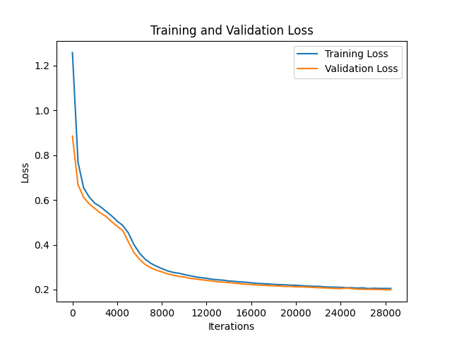
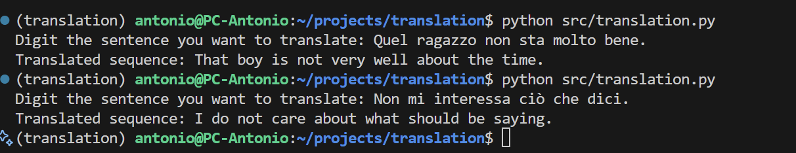

# Translation Transformer

I just wanted to play a bit and code from scratch one of the most famous paper in the AI history: *Attention is All You Need by Vaswani et al. (2017)*.

The architecture is of course identical to what papers authors describe. The dataset I used for this funny experiment was: [g8a9/europarl_en-it](https://huggingface.co/datasets/g8a9/europarl_en-it).

Since it's a toy example, I just needed a small interesting dataset, and I used this one because it made me able to reach "interesting" translation capabilities from italian to english. Since I do not have paid license of GitHub Copilot, I was not able (luckily) to have support from an AI to write the codebase. I have just have the free license, so I used the limited calls for writing methods' docstrings and Python type hints.

To run this experiment I rented a NVIDIA A5000 for around 15 hours ($9 total). From the plot below you can see that using a batch size of 128 I was able to run around 28k iterations.



As you can see, results are not so bad considering the dataset size and the small number of iterations and trials. The goal of this experiment was just coding a pure Transformer and have fun!



## Installation and usage:
```
git clone https://github.com/antonioagostino/translation.git
cd translation
conda env create -f environment.yaml
```

Honestly, I do not want to maintain this repo, and since there a lot of implementations of the Transformer architecture out there, I don't think you will need this repo. But, if you find it useful, give me a star :)

I leave here the link to download the last checkpoint of the training you can see in the plot above: [Google Drive Link](https://drive.google.com/file/d/17mp0vSYvt2g24h23903qNfRuRkSRljaD/view?usp=sharing). Just download it and run the *src/translation.py* script.

Enjoy it!

PS: just a small note about the tokenizer, since I wanted to code it in pure PyTorch and from scratch, I didn't want to use *tiktoken* or other BPE or WordPiece tokenizers. The project is very small, so I thought it was enough to code a simple character-level tokenizer with some special tokens.
